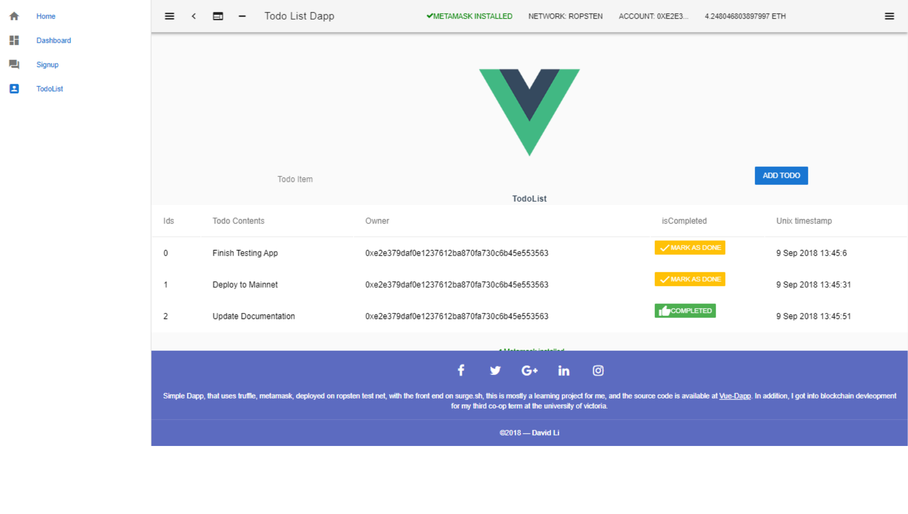

[](https://travis-ci.org/FriendlyUser/Vue-Dapp) [](https://zenodo.org/badge/latestdoi/138513381)

# Summary

The can viewed at http://todoListDApp.surge.sh.

This app uses vuetify, vue, metamask and truffle.

This deployed on all test nets including ropsten, kovan and rinkeby via infura.


## Installation
Make sure the following global packages are installed
```sh
npm install truffle ganache-cli jest
```

```sh
npm install 
```

The build artifacts are including inside the repo.

#### References
* [Link](https://itnext.io/create-your-first-ethereum-dapp-with-web3-and-vue-js-part-2-52248a74d58a)
* [Dapp Uni] (https://github.com/dappuniversity)
* [Dapp Tutorial](https://github.com/danielefavi/ethereum-vuejs-dapp)
